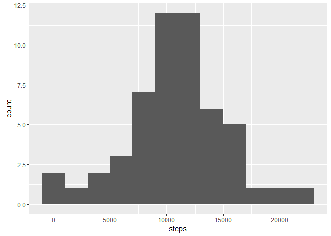
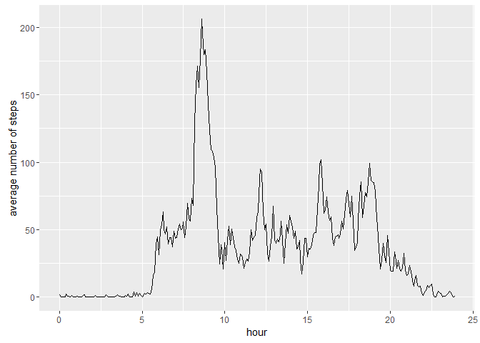
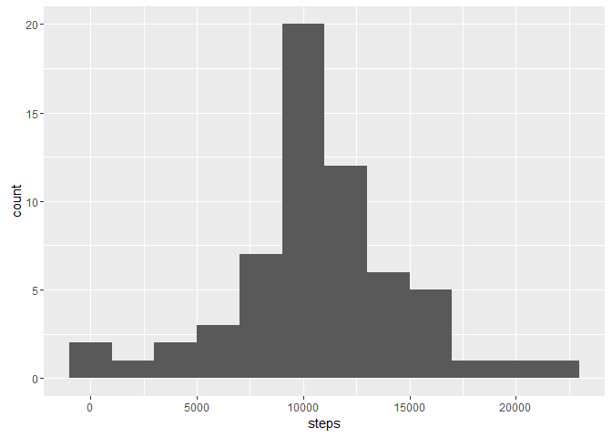
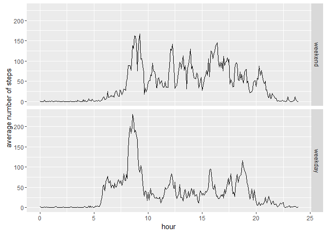

# Reproducible Research: Peer Assessment 1


## Loading and preprocessing the data


Load data as data.table using fread

```r
library(data.table)
unzip("activity.zip")
activity <- fread("activity.csv")
```

Chech the basic charasteristics

```r
str(activity)
```

```
## Classes 'data.table' and 'data.frame':	17568 obs. of  3 variables:
##  $ steps   : int  NA NA NA NA NA NA NA NA NA NA ...
##  $ date    : chr  "2012-10-01" "2012-10-01" "2012-10-01" "2012-10-01" ...
##  $ interval: int  0 5 10 15 20 25 30 35 40 45 ...
##  - attr(*, ".internal.selfref")=<externalptr>
```

Date is stored as a character so transform it to date for further analysis.

```r
library(lubridate)
```

```
## 
## Attaching package: 'lubridate'
```

```
## The following objects are masked from 'package:data.table':
## 
##     hour, mday, month, quarter, wday, week, yday, year
```

```
## The following object is masked from 'package:base':
## 
##     date
```

```r
activity[,date := ymd(date)]
summary(activity)
```

```
##      steps             date               interval     
##  Min.   :  0.00   Min.   :2012-10-01   Min.   :   0.0  
##  1st Qu.:  0.00   1st Qu.:2012-10-16   1st Qu.: 588.8  
##  Median :  0.00   Median :2012-10-31   Median :1177.5  
##  Mean   : 37.38   Mean   :2012-10-31   Mean   :1177.5  
##  3rd Qu.: 12.00   3rd Qu.:2012-11-15   3rd Qu.:1766.2  
##  Max.   :806.00   Max.   :2012-11-30   Max.   :2355.0  
##  NA's   :2304
```

There are some missing values on the step variable. Other variables are complete. We can also see that step count is highly skewed. The value for most intervals is zero and mean is much higher than median.

Remove missing values from subsequent analysis.


```r
activitycc <- subset(activity,complete.cases(activity))
```


## What is mean total number of steps taken per day?

Calculate total number of steps by date, plot the histogram and calculate the mean and median of steps.


```r
library(ggplot2)
sumsteps <- activitycc[,sum(steps), by=date]
setnames(sumsteps, "V1", "steps")

qplot(steps, data = sumsteps,binwidth=2000)
```



```r
mean(sumsteps$steps)
```

```
## [1] 10766.19
```

```r
median(sumsteps$steps)
```

```
## [1] 10765
```
The total steps per day looks seems to follow fairly closely to the normal distribution and mean and median are very close together. There's a small peak for low step values, though.

## What is the average daily activity pattern?

Calculate average steps by interval. Add the variable hour by making a sequence along the interval. The sequence - 1 corresponds 5 minutes of time, so we can convert this to hours by dividing by 60 and multiplying by 5. This makes the timeseries look much nicer as there won't be any gaps like when using the interval variable.


```r
avgsteps <- activitycc[,mean(steps), by=interval]
setnames(avgsteps, "V1", "steps")
avgsteps[,hour:=((seq_along(interval)-1)*5/60)]
qplot(hour, steps, data = avgsteps, geom="line", ylab="average number of steps")
```



Which 5-minute interval, on average across all the days in the dataset, contains the maximum number of steps?

```r
avgsteps[which.max(avgsteps$steps),interval]
```

```
## [1] 835
```
On average maximum number of steps gets recorded between 8:35 and 8:40. This is consistent with the time series plot

## Imputing missing values

Add missing data indicator to the data table and calculate the number of missing values

```r
activity[,missing := is.na(steps)]
sum(activity$missing)
```

```
## [1] 2304
```

There are 2304 NA values in steps. Let's table date and missing values

```r
table(activity$date,activity$missing)
```

```
##             
##              FALSE TRUE
##   2012-10-01     0  288
##   2012-10-02   288    0
##   2012-10-03   288    0
##   2012-10-04   288    0
##   2012-10-05   288    0
##   2012-10-06   288    0
##   2012-10-07   288    0
##   2012-10-08     0  288
##   2012-10-09   288    0
##   2012-10-10   288    0
##   2012-10-11   288    0
##   2012-10-12   288    0
##   2012-10-13   288    0
##   2012-10-14   288    0
##   2012-10-15   288    0
##   2012-10-16   288    0
##   2012-10-17   288    0
##   2012-10-18   288    0
##   2012-10-19   288    0
##   2012-10-20   288    0
##   2012-10-21   288    0
##   2012-10-22   288    0
##   2012-10-23   288    0
##   2012-10-24   288    0
##   2012-10-25   288    0
##   2012-10-26   288    0
##   2012-10-27   288    0
##   2012-10-28   288    0
##   2012-10-29   288    0
##   2012-10-30   288    0
##   2012-10-31   288    0
##   2012-11-01     0  288
##   2012-11-02   288    0
##   2012-11-03   288    0
##   2012-11-04     0  288
##   2012-11-05   288    0
##   2012-11-06   288    0
##   2012-11-07   288    0
##   2012-11-08   288    0
##   2012-11-09     0  288
##   2012-11-10     0  288
##   2012-11-11   288    0
##   2012-11-12   288    0
##   2012-11-13   288    0
##   2012-11-14     0  288
##   2012-11-15   288    0
##   2012-11-16   288    0
##   2012-11-17   288    0
##   2012-11-18   288    0
##   2012-11-19   288    0
##   2012-11-20   288    0
##   2012-11-21   288    0
##   2012-11-22   288    0
##   2012-11-23   288    0
##   2012-11-24   288    0
##   2012-11-25   288    0
##   2012-11-26   288    0
##   2012-11-27   288    0
##   2012-11-28   288    0
##   2012-11-29   288    0
##   2012-11-30     0  288
```

There are eight dates with no step data recorded, all the other dates have full data. 

As the missing data involves whole days, it makes no sense to fill the data with mean of the day. The individual intervals have skeved data, which in this case makes median a poor choice. So we will impute the missing data by mean value of the interval over the all other days. Set the steps variable to be steps with missing values replaced by mean steps by interval ignoring missing values. In data.table this can be done easily on one line, but first we need to make a explicit copy of the original data to avoid messing with it and convert the steps variable from integer to numeric to avoid coercion errors.


```r
activity.imputed <- copy(activity)
activity.imputed[,steps := as.numeric(steps)]
activity.imputed[, steps := replace(steps, is.na(steps), mean(steps, na.rm=TRUE)), by = interval]
```
Calculate total number of steps by date, plot the histogram and calculate the mean and median of steps.

```r
sumsteps <- activity.imputed[,sum(steps), by=date]
setnames(sumsteps, "V1", "steps")

qplot(steps, data = sumsteps,binwidth=2000)
```



```r
mean(sumsteps$steps)
```

```
## [1] 10766.19
```

```r
median(sumsteps$steps)
```

```
## [1] 10766.19
```
The histogram looks very similar to the original, but is has a higher peak in the middle. Mean of imputed data is exactly the same as that of the original data with missing values removed, but median has changed to be exactly the same as the mean. This is due to adding eight days with the sum of daily steps being the average. As we chose to impute missing values with mean value for interval, the sum of those averages is exactly the same as the average value of daily sums. So imputation changes the histogram and the median value, but the average remains the same. Had we decided to use median value for interval, the mean and median values would be considerably lower and the histogram would have a high peak in low step count. This is due to the fact that step counts for individual intervals are highly skewed and using median would distort the data towards lower step counts.


## Are there differences in activity patterns between weekdays and weekends?

Create factor variable weekend for imputed data with value "weekend" for Sundays and Saturdays (having wday values 1 and 7 respectively) and "weekday" for other days:


```r
activity.imputed[,weekend := factor(wday(date) %in% c(1,7), 
                                    levels=c(TRUE,FALSE),
                                    labels=c("weekend", "weekday"))]
```

Calculate the mean steps by interval and weekend. Again I make a new variable hour for plotting the timeseries. (I know this is not required, but I can't stand creating gappy plots if I can avoid it.) The by=weekend argument makes the interval to be created separately for both groups so the hour value is in sync with the original interval.


```r
avgsteps <- activity.imputed[,mean(steps), by=.(interval,weekend)]
setnames(avgsteps, "V1", "steps")
avgsteps[,hour:=((seq_along(interval)-1)*5/60), by=weekend]
qplot(hour, steps, data = avgsteps, geom="line", ylab="average number of steps",facets= weekend~.)
```



The weekend and weekday patterns are somewhat different. The greatest difference seems to be that there's much more pronounced peak in weekday mornings presumably when the test subject goes to work. During other times of day the activity seems to be a bit higher on weekends and it also continues later than on weekdays. On the other hand, activity starts earlier on weekdays. This all seems natural assuming the test subject goes to work on weekdays and has free time on weekends.
